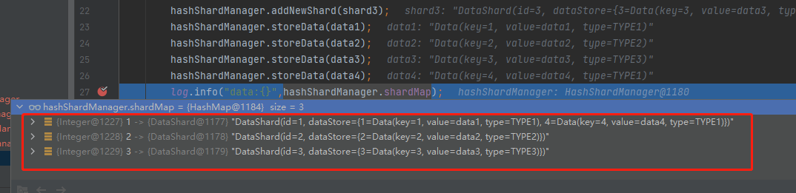
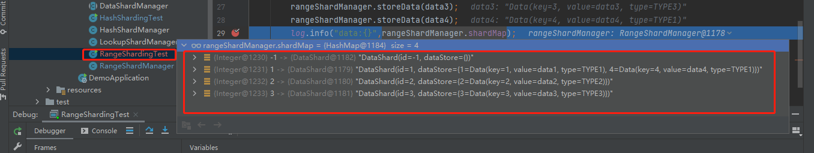

数据分片算法简单示例

分库分表算法

常见数据分片算法 包括：哈希算法、范围限定算法、查找表算法。

哈希算法哈希算法很常见， 按照订单 ID 取模就是一种简单的哈希算法。如果想要构建比较复杂的哈希算法，我们可以基于数据表中的一系列字段进行计算。

范围限定算法范围限定也是一种常见的分片算法，我们可以基于年月、性别等具备范围概念的数据来执行分片策略。

查找表算法所谓查找表（Lookup），就是基于特定的分配策略将数据存在到目标表中，然后再基于这一策略进行查询。

源码基于：https://time.geekbang.org/dailylesson/detail/100110795

便于大家学习使用，及供参考

hashshading:

rangeshading:

